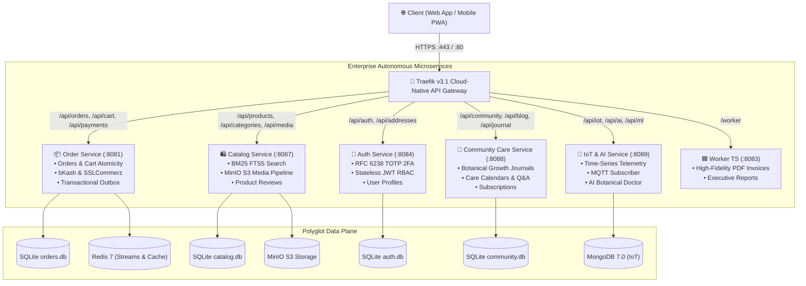

# 🌿 Kather Baksho — Cloud-Native Backend Microservices Platform

The enterprise, distributed backend microservices ecosystem powering **Kather Baksho (কাঠের বাক্স)** — Bangladesh's automated urban botanical commerce, smart gardening, and IoT ecosystem.

[](https://golang.org/)
[](https://traefik.io/)
[](https://docs.docker.com/compose/)
[](https://kubernetes.io/)
[](https://helm.sh/)
[](https://redis.io/)
[](https://mongodb.com/)
[](https://min.io/)

---

## 🏛️ System Architecture



---

## 📦 Microservices Breakdown

| Service | Technology | Port | Core Responsibilities |
|---|---|---|---|
| **`order-service`** | Go 1.25 / GORM | `8081` | Cart reservation, ACID checkout, bKash & SSLCommerz gateways, Transactional Outbox, SMS engine. |
| **`catalog-service`** | Go 1.25 / GORM | `8087` | Product catalog, categories, BM25 FTS5 typos-tolerant search, MinIO S3 upload/serving, reviews. |
| **`auth-service`** | Go 1.25 / GORM | `8084` | Identity & access management, pure-Go RFC 6238 TOTP 2FA, customer addresses CRUD, Admin RBAC. |
| **`community-care-service`** | Go 1.25 / GORM | `8088` | Community posts, Q&A, gardening groups, botanical growth journals, seasonal care schedules, subscriptions. |
| **`iot-ai-service`** | Go 1.25 / Mongo / MQTT | `8089` | MongoDB time-series telemetry ingestion, MQTT subscriber, Telegram bot alerts, AI symptom diagnosis. |
| **`worker-ts`** | Node.js 20 / TypeScript 5.5 | `8083` | Asynchronous high-resolution PDF invoice generation, executive analytics reports. |
| **`traefik`** | Traefik v3.1 | `8085` / `443` | Cloud-Native API Gateway, path prefix routing, Let's Encrypt automated TLS, rate limiting. |

---

## 🚀 1-Command Production Deployment (Linux VPS)

Works on any **Ubuntu 22.04 / 24.04** VPS (Hetzner, DigitalOcean, AWS EC2, Contabo, etc.):

```bash
# 1. Clone repository on your VPS
git clone https://github.com/iftakhar-323/kather_baksho-backend.git
cd kather_baksho-backend

# 2. Run the automated deployment orchestrator
./scripts/deploy.sh
```

The script automatically:
1. Detects or installs Docker and Docker Compose.
2. Creates `.env` from `.env.production.example`.
3. Compiles and launches all 15 microservices and backing stores.
4. Verifies `/readyz` health status across all services.

---

## ☸️ Kubernetes & Helm Deployment

### Native Kubernetes Manifests (Kustomize):
```bash
kubectl apply -k deploy/k8s/
```

### Helm 3 Deployment:
```bash
helm install kather-baksho deploy/helm/kather-baksho -n kather-baksho --create-namespace
```

---

## 🧪 Comprehensive Verification & Stress Testing

Run the included automated test suite against the backend:

```bash
# 1. Run all 66 End-to-End integration tests
python3 tests/e2e_test.py

# 2. Run Flash Sale Concurrency & Race Condition Benchmark (50 competitors, 5 stock units)
python3 tests/stress_test.py --concurrency 50 --stock 5
```

### Benchmark Result:
```text
======================================================================
🔥 KATHER BAKSHO FLASH SALE CONCURRENCY BENCHMARK
======================================================================
  Competitors:            50 concurrent threads
  Limited Stock:          5 units available
----------------------------------------------------------------------
  Total Requests:         50
  Successful Checkouts:   5 (Expected: 5)
  Rejected (Out-of-Stock):45 (Expected: 45)
  Oversold Stock Units:   0
  Throughput:             468.7 req/sec
  Latency Median (p50):   45.70 ms
----------------------------------------------------------------------
✅ PASS: 100% ACID Atomicity Confirmed. ZERO Overselling!
======================================================================
```

---

## ⚙️ Environment Configuration

Refer to [`.env.production.example`](.env.production.example) for all available configuration options, including JWT secret, allowed CORS origins, Let's Encrypt ACME email, and payment credentials.

---

## 📄 License
This project is open-source and available under the MIT License.
